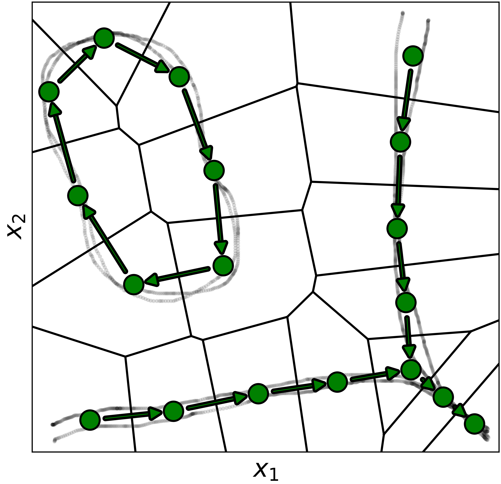
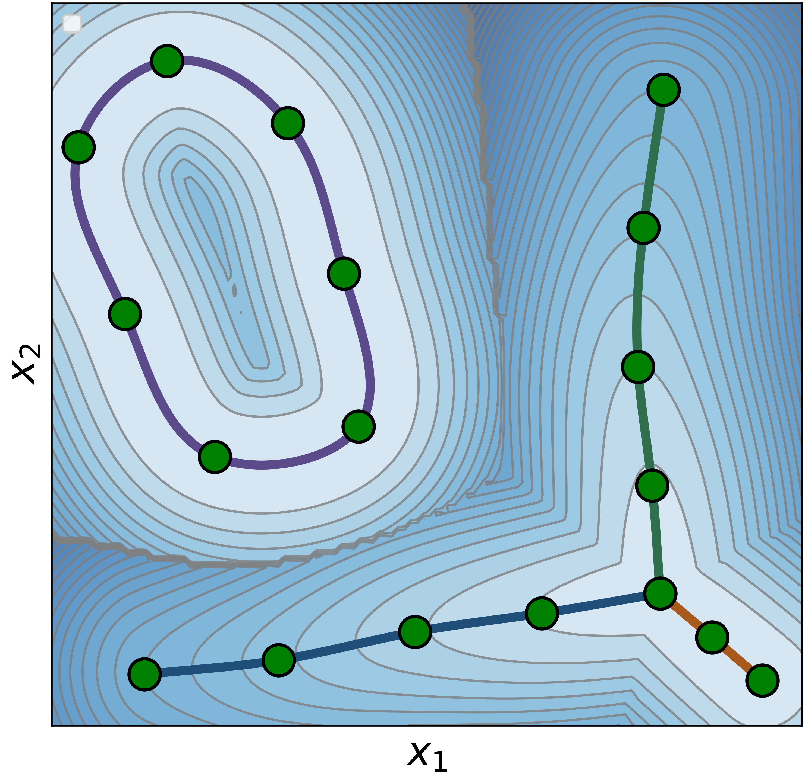
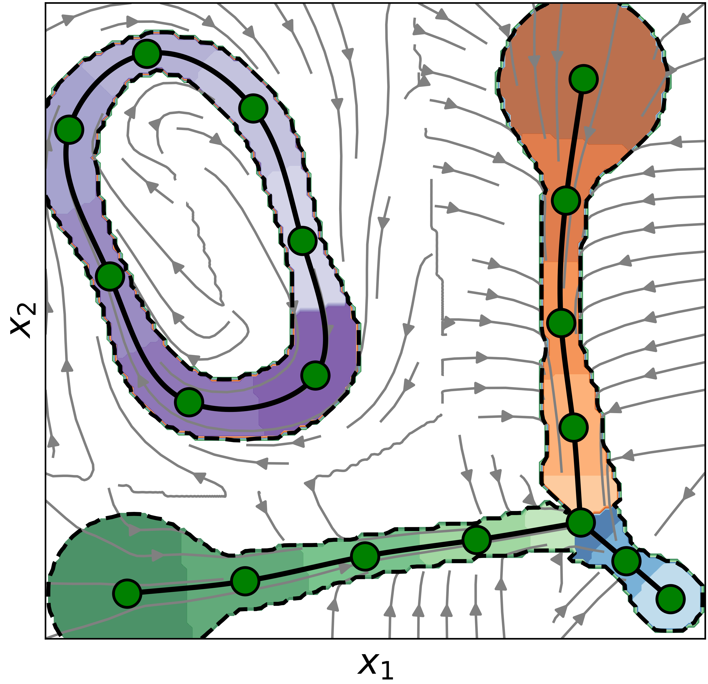
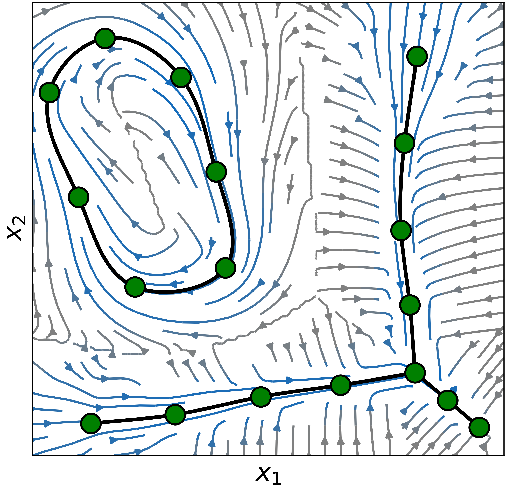

# TopoDS

TopoDS learns a topology-informed asymptotically stable dynamical system from expert demonstrations, resulting in a reactive and predictable robot motion policy.
This repository contains the reusable learning and inference implementation,
plus examples using the LASA handwriting benchmark and a bundled recorded
demonstration with complex topology.

<table>
  <tr>
    <td align="center"></td>
    <td align="center"></td>
    <td align="center"></td>
    <td align="center"></td>
  </tr>
  <tr>
    <td align="center"><strong>Topology</strong></td>
    <td align="center"><strong>Lyapunov function</strong></td>
    <td align="center"><strong>Local Activations</strong></td>
    <td align="center"><strong>Dynamics</strong></td>
  </tr>
</table>

## Installation

Create an environment with Python 3.11 or newer and install the package:

```bash
python -m venv .venv
source .venv/bin/activate
python -m pip install -e .
```

## LASA example

Run the included `LASA 2D` example:

```bash
python examples/lasa.py
```

The example loads LASA demonstrations, fits a `TopoDS` model, and displays its
diagnostic plots. It prints the shapes exposed by `pyLasaDataset` and prompts
for the number of the shape to use.

## Complex-topology example

Run the example based on complex topology example in the publication:

```bash
python examples/complex_topology.py
```

The example loads `data/complex_topology.npz`, fits a `TopoDS` model, rolls out
the learned dynamics from each demonstration start, and displays the results.


## License

MIT
